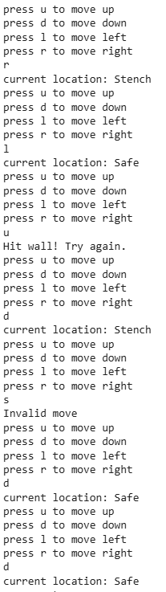

<h1>ExpNo 9: Solve Wumpus World Problem using Python demonstrating Inferences from Propositional Logic</h1> 
<h3>Name:NARENDHIRAN P </h3>
<h3>Register Number: 212224230177 </h3>
<H3>Aim:</H3>
<p>
    To solve  Wumpus World Problem using Python demonstrating Inferences from Propositional Logic
</p>
<h1>Problem Description</h1>
<hr>
<h2>Wumpus World</h2>
<hr>
The Wumpus world is a simple world example to illustrate the worth of a knowledge-based agent and to represent knowledge representation.

The figure below shows a Wumpus world containing one pit and one Wumpus. There is an agent in room [1,1]. The goal of the agent is to exit the Wumpus world alive. The agent can exit the Wumpus world by reaching room [4,4]. The wumpus world contains exactly one Wumpus and one pit. There will be a breeze in the rooms adjacent to the pit, and there will be a stench in the rooms adjacent to Wumpus.


<center>Wumpus World Representation</center>
<p>
This is a python program that uses propositional logic sentences to check which rooms are safe. 

It is assumed that there will always be a safe path that the agent can take to exit the Wumpus world. The logical agent can take four actions: Up, Down, Left and Right. These actions help the agent move from one room to an adjacent room. The agent can perceive two things: Breeze and Stench.
</p>

<hr>
<h1>Sample Input and Output:</h1>
<hr>


## PROGRAM:
```py
size = 4

world = [["Safe" for _ in range(size)] for _ in range(size)]

# Correct positions
wumpus = (1,1)
pit = (2,2)
gold = (3,1)

world[wumpus[0]][wumpus[1]] = "WUMPUS"
world[pit[0]][pit[1]] = "PIT"
world[gold[0]][gold[1]] = "GOLD"

moves = [(1,0),(-1,0),(0,1),(0,-1)]

# Breeze around pit
for m in moves:
    r = pit[0] + m[0]
    c = pit[1] + m[1]
    if 0 <= r < size and 0 <= c < size and world[r][c] == "Safe":
        world[r][c] = "Breeze"

# Stench around wumpus
for m in moves:
    r = wumpus[0] + m[0]
    c = wumpus[1] + m[1]
    if 0 <= r < size and 0 <= c < size and world[r][c] == "Safe":
        world[r][c] = "Stench"

x = 0
y = 0

score = 0

while True:

    print("press u to move up")
    print("press d to move down")
    print("press l to move left")
    print("press r to move right")

    move = input()

    if move == 'u':
        x -= 1
    elif move == 'd':
        x += 1
    elif move == 'l':
        y -= 1
    elif move == 'r':
        y += 1
    else:
        print("Invalid move")
        continue

    if x < 0 or y < 0 or x >= size or y >= size:
        print("Hit wall! Try again.")
        x = max(0, min(x, size-1))
        y = max(0, min(y, size-1))
        continue

    location = world[x][y]

    if location == "PIT":
        print("You fell into a PIT!")
        print("Game Over")
        break

    elif location == "WUMPUS":
        print("WUMPUS got you!")
        print("Game Over")
        break

    elif location == "GOLD":
        print("current location: GOLD")
        print("\nGOLD FOUND! You won....")
        score = 1000
        print("Your score is:", score)
        break

    else:
        print("current location:", location)
```
## OUTPUT:


## RESULT:

Thus, program for WUMPUS WORLD has been executed successfully.
